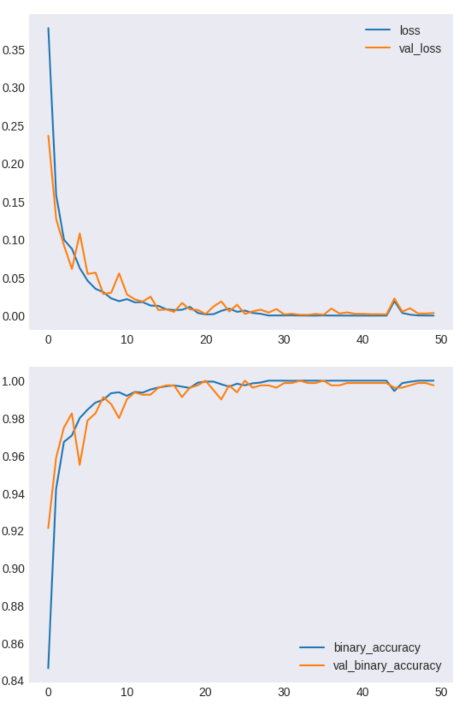
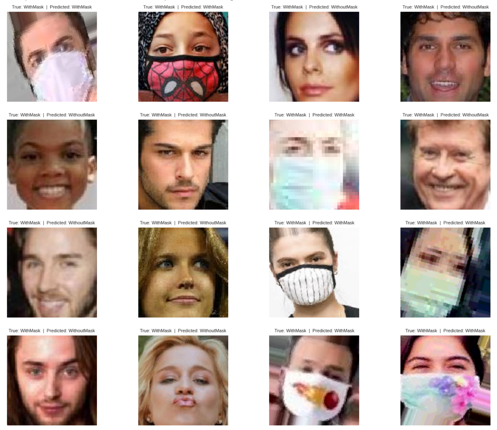

# 마스크 착용 유/무  이미지 인식
### 개요
코로나 바이러스 확산으로 인해 정부의 마스크 착용 지침으로 외출 시 마스크 착용은 의무화가 되었습니다.  
CNN 모델로 사람의 이미지를 통해 마스크 착용 유/무를 인식하는 모델을 만들었습니다. 

### 캐글 데이터셋  
[Face Mask Detection ~12K Images Dataset](https://www.kaggle.com/datasets/ashishjangra27/face-mask-12k-images-dataset) 
### 데이터셋 설명
데이터셋은 Test, Train, Validation 3개의 폴더로 나눠져 있으며, 각 폴더에는 WithMask(마스크를 착용한 사람의 이미지)와 WithoutMask(마스크를 착용하지 않은 사람의 이미지)로 구성되어있다.  
  
Face Mask Dataset. 
* Test  
  * WithMask
  * WithoutMask
* Train
  * WithMask
  * WithoutMask
* Validation
  * WithMask
  * WithoutMask

예측 값은 WithMask, WithoutMask로 나눠야 함으로 2개의 class로 만들었습니다.

### 모델 성능
</a>
  
### 결과
</a>

### 문제점
실제 class를 제대로 인식하지 못하는 경우가 있고 예측값도 오분류가 있습니다.
훈련 데이터의 정확도는 높지만 오분류가 있는 것을 보고 학습데이터에 모델이 과적합(overfitting)되어 있다고 판단

### 향후 과제
- ImageAugmentation(이미지 증강)을 통해 이미지 데이터를 늘려서 학습
- 모델 복잡도를 줄이기
- 가중치 규제(Regularization) 적용
- 드롭아웃(Drop-out)
